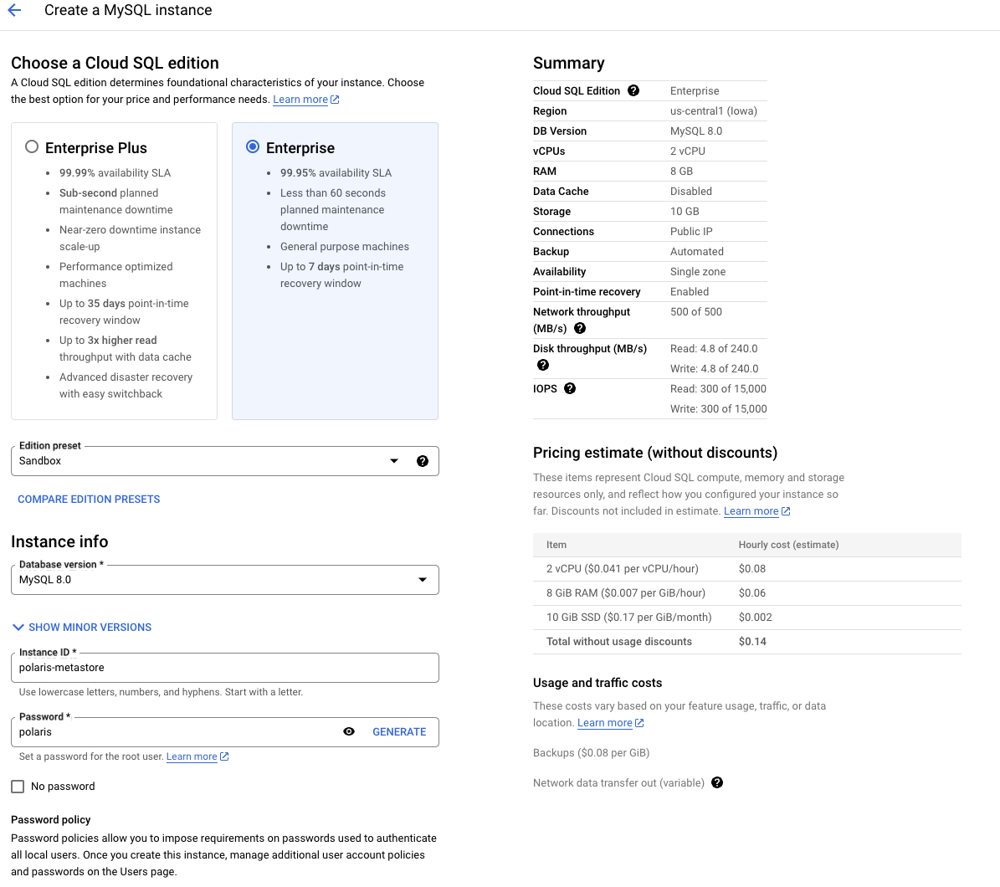
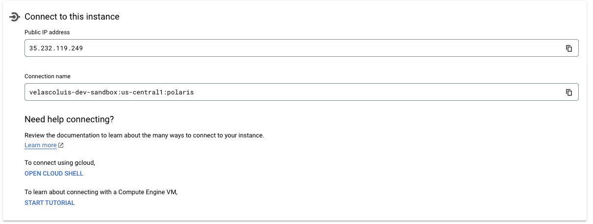
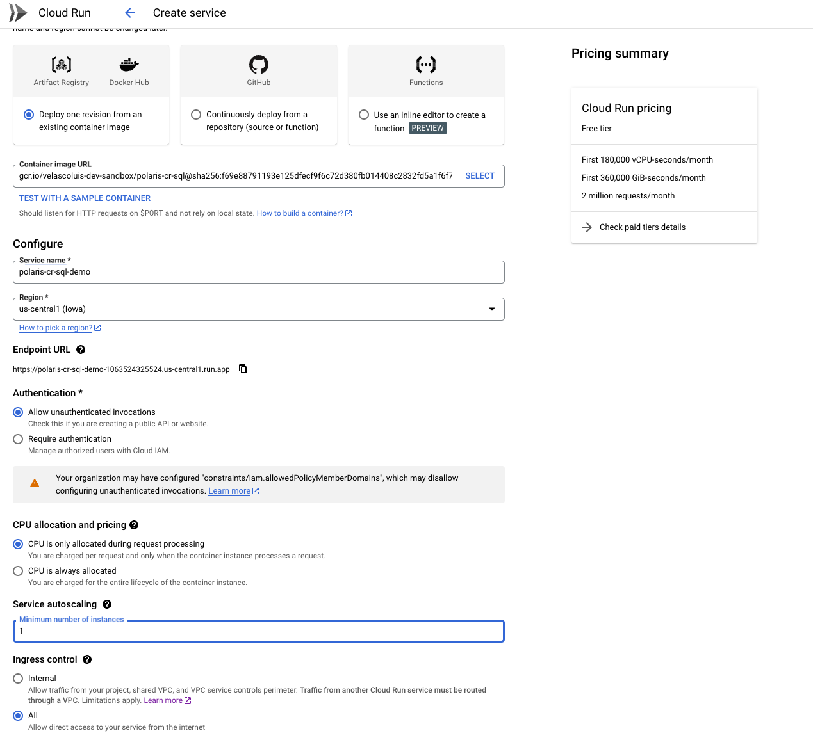
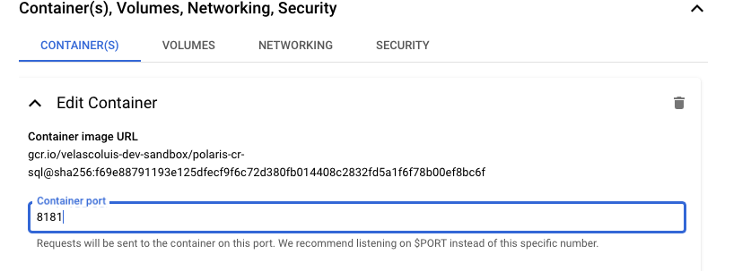
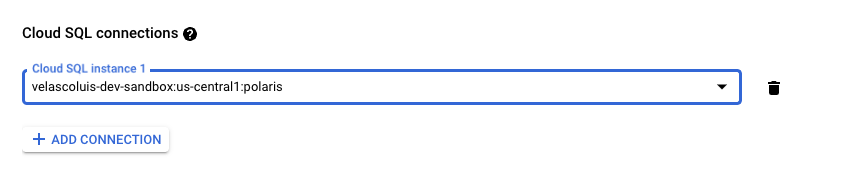
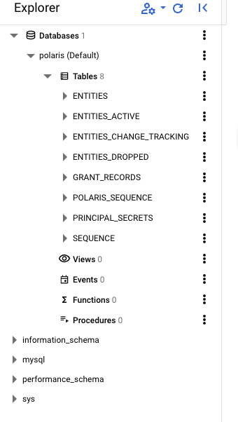

# Serverless Apache Polaris on Google Cloud Run with Cloud SQL as metastore

This guide shows how to deploy Apache Polaris on a Google Cloud Run Instance pointing to a Google Cloud SQL as its metastore.

## Metastore backend setup

Navigate to the Cloud SQL console and deploy a Cloud SQL MySQL 8 instance, for example:



## Metastore configuration

Open a terminal (e.g. Cloud Shell) and clone the Apache Polaris repository

```bash
git clone <https://github.com/apache/polaris.git>
cd polaris
```

Lets configure the the Cloud SQL instance as metastore

Edit the `polaris-server.yml` file located at the root and change the `metaStoreManager` property:

```yml
metaStoreManager:
 #type: in-memory
 type: eclipse-link # uncomment to use eclipse-link as metastore
 conf-file: META-INF/persistence.xml
 persistence-unit: polaris
```

Next, edit the `persistence.xml` located on `extension/persistence/eclipselink/src/main/resources/META-INF/`

Edit the persistence unit defined on the `polaris-sever.yml`, in this case there is only one (polaris), but you can use some others like dev , prod etc ..

```xml
  <persistence-unit name="polaris" transaction-type="RESOURCE_LOCAL">
    <provider>org.eclipse.persistence.jpa.PersistenceProvider</provider>
    <class>org.apache.polaris.core.persistence.models.ModelEntity</class>
    <class>org.apache.polaris.core.persistence.models.ModelEntityActive</class>
    <class>org.apache.polaris.core.persistence.models.ModelEntityChangeTracking</class>
    <class>org.apache.polaris.core.persistence.models.ModelEntityDropped</class>
    <class>org.apache.polaris.core.persistence.models.ModelGrantRecord</class>
    <class>org.apache.polaris.core.persistence.models.ModelPrincipalSecrets</class>
    <class>org.apache.polaris.core.persistence.models.ModelSequenceId</class>
    <shared-cache-mode>NONE</shared-cache-mode>
    <properties>
     <property name="jakarta.persistence.jdbc.url" value="jdbc:mysql://google/polaris?cloudSqlInstance=velascoluis-dev-sandbox:us-central1:polaris&amp;socketFactory=com.google.cloud.sql.mysql.SocketFactory"/>
     <property name="jakarta.persistence.jdbc.user" value="polaris"/>
     <property name="jakarta.persistence.jdbc.password" value="polaris"/>
     <property name="jakarta.persistence.schema-generation.database.action" value="create"/>
     <property name="eclipselink.logging.level.sql" value="FINE"/>
     <property name="eclipselink.logging.parameters" value="true"/>
     <property name="eclipselink.persistence-context.flush-mode" value="auto"/>
    </properties>
  </persistence-unit>
```

The `cloudSqlInstance` of the `jakarta.persistence.jdbc.url` property can be taken from the Overview page of Cloud SQL in the Google Cloud console.



Next, edit the `build.gradle.kts` file located on `extension/persistence/eclipselink` and add the dependencies:

```kts
dependencies {
…
 implementation("com.google.cloud.sql:mysql-socket-factory-connector-j-8:1.20.0")
 implementation("com.mysql:mysql-connector-j:8.4.0")
… }
```

## Container deployment

First, make sure you can build the service locally, execute on the root directory of the repository:

```bash
./gradlew --no-daemon --info -PeclipseLink=true -PeclipseLinkDeps=com.mysql:mysql-connector-j:8.4.0,com.google.cloud.sql:mysql-socket-factory-connector-j-8:1.20.0 clean shadowJar
```

Now in the root directory, create a `cloudbuild.yml` file with the contents:

```yml
steps:

- name: 'gcr.io/cloud-builders/docker'
 args: ['build',
        '--build-arg', 'ECLIPSELINK=true',
        '-t', 'gcr.io/velascoluis-dev-sandbox/polaris-cr-sql',
        '.']
images:
- 'gcr.io/velascoluis-dev-sandbox/polaris-cr-sql'
```

Change your project id (`velascoluis-dev-sandbox`) and image name (`polaris-cr-sql`) according to your setup.

Next, we can build the image, execute on the root folder of the repository:

```bash
gcloud builds submit --config cloudbuild.yml
```

Once the container is built navigate to the Cloud Run page on the Google Cloud console an deploy the image:



Make sure the container port is listening on 8181, or change it to your desired port on the `polaris-server.yml` config. file



Make sure at the end you add the Cloud SQL connection



Once the service is deployed, you need to bootstrap the database schema, for that execute:

```bash
docker run -it gcr.io/velascoluis-dev-sandbox/polaris-cr-sql:latest bootstrap ./polaris-server.yml
```

Change the project id and image name according to your setup.

Now, navigate to the Cloud SQL and check the schema is deployed



Get the principal client id key and secret executing in the SQL database, they are stored on the `principal_secrets` table:
You can use for instance Cloud SQL Studio to run your query:

```sql
SELECT PRINCIPALCLIENTID,MAINSECRET FROM
 `polaris`.`PRINCIPAL_SECRETS` LIMIT 1000;
```

## Example usage of Polaris admin API

Lets use the polaris CLI to interact with Polaris, for that, execute in the root folder of the repository:

```bash
./polaris
```

This will build and deploy the CLI locally, but there is a hack to make CLI work with Cloud Run, as Cloud Runs URIs need no port, go your python lib folder where the package is installed and change the following [line](https://github.com/apache/polaris/blob/9e26fb69a022241558e3866bd665911ec0a88400/regtests/client/python/cli/polaris_cli.py#L111) on the `polaris_cli.py` file:

```python
polaris_management_url = f'http://{options.host}:{options.port}/api/management/v1'
        polaris_catalog_url = f'http://{options.host}:{options.port}/api/catalog/v1'
```

for

```python
polaris_management_url = f'https://{options.host}/api/management/v1'
polaris_catalog_url = f'https://{options.host}:/api/catalog/v1'
```

Now you can interact with Polaris, some example commands:

```bash
# Create catalog
CLIENT_ID=<YOUR_CLIENT_ID>
CLIENT_SECRET=<YOUR_CLIENT_SECRET>
POLARIS_CR_URI=<SERVICE_NAME>.us-central1.run.app
polaris --host  ${POLARIS_CR_URI} --port  8181  \
--client-id  ${CLIENT_ID} \
--client-secret  ${CLIENT_SECRET}\
catalogs create \
--storage-type gcs \
--default-base-location gs://<GCS_URI>
test_iceberg_catalog


# List catalogs 
CLIENT_ID=<YOUR_CLIENT_ID>
CLIENT_SECRET=<YOUR_CLIENT_SECRET>
POLARIS_CR_URI=<SERVICE_NAME>.us-central1.run.app
polaris --host  ${POLARIS_CR_URI} --port  8181  \
--client-id  ${CLIENT_ID} \
--client-secret  ${CLIENT_SECRET}\
catalogs list


# Grant privileges
polaris --host  ${POLARIS_CR_URI} --port  8181  \
--client-id  ${CLIENT_ID} \
--client-secret  ${CLIENT_SECRET}\
privileges \
catalog \
grant \
--catalog test_iceberg_catalog \
--catalog-role catalog_admin \
TABLE_CREATE

polaris --host  ${POLARIS_CR_URI} --port  8181  \
--client-id  ${CLIENT_ID} \
--client-secret  ${CLIENT_SECRET}\
privileges \
catalog \
grant \
--catalog polaris_iceberg \
--catalog-role catalog_admin \
TABLE_WRITE_DATA
```

## Example usage of Polaris from an Data Engine

Next, lets see how can we use Polaris from an Data Processing Engine, in this case lets just use pyIceberg for simplicty, but you can try with others, for example Spark

```python
from pyiceberg.catalog.sql import RestCatalog
import pyarrow as pa
from pyiceberg.schema import Schema
from pyiceberg.types import NestedField, StringType, IntegerType, BooleanType, LongType


def _get_pyiceberg_catalog(polaris_uri,credentials,catalog_name):
   return RestCatalog(
       name="polaris",
       uri=polaris_uri,
       warehouse=catalog_name,
       credential=credentials,
       scope="PRINCIPAL_ROLE:ALL",
   )
  
def _create_demo_namespace_and_table(catalog):
   if NAMESPACE in catalog.list_namespaces():
       catalog.drop_namespace(NAMESPACE)
   catalog.create_namespace_if_not_exists(NAMESPACE)

   df = pa.Table.from_pylist(
       [
           {
               "q": "Q1",
               "product": "Widget",
               "region": "EMEA",
               "sales": 1000,
               "units": 100,
           },
           {
               "q": "Q2",
               "product": "Gadget",
               "region": "EMEA",
               "sales": 1500,
               "units": 150,
           },
           {
               "q": "Q3",
               "product": "Widget",
               "region": "EMEA",
               "sales": 1200,
               "units": 120,
           },
           {
               "q": "Q4",
               "product": "Gadget",
               "region": "EMEA",
               "sales": 2000,
               "units": 200,
           },
       ]
   )


   schema = Schema(
       NestedField(1, "q", StringType(), required=False),
       NestedField(2, "product", StringType(), required=False),
       NestedField(3, "region", StringType(), required=False),
       NestedField(4, "sales", LongType(), required=False),
       NestedField(5, "units", LongType(), required=False),
   )


   if catalog.table_exists(f"{NAMESPACE}.{TABLE_NAME}"):
       catalog.drop_table(f"{NAMESPACE}.{TABLE_NAME}")
   tbl = catalog.create_table_if_not_exists(
       identifier=f"{NAMESPACE}.{TABLE_NAME}",
       schema=schema,
   )
   tbl.append(df)


catalog = _get_pyiceberg_catalog(
   polaris_uri="https://<SERVICE_NAME>.us-central1.run.app/api/catalog",
   credentials="<CLIENT_ID>:<CLIENT_SECRET>",
   catalog_name="test_iceberg_catalog"
)
_create_demo_namespace_and_table(catalog)


table = catalog.load_table(f"{NAMESPACE}.{TABLE_NAME}")
con = table.scan().to_arrow()

```

This concludes the guide.
